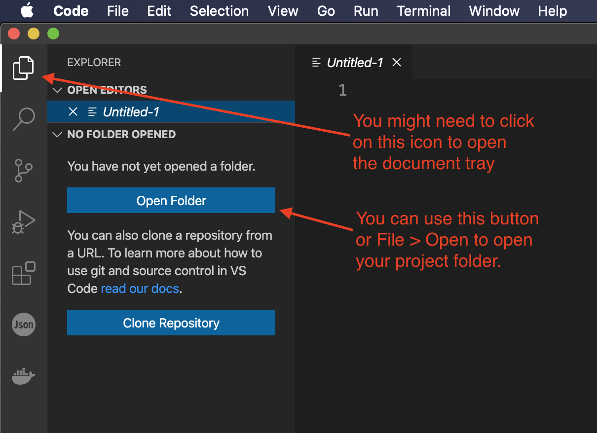
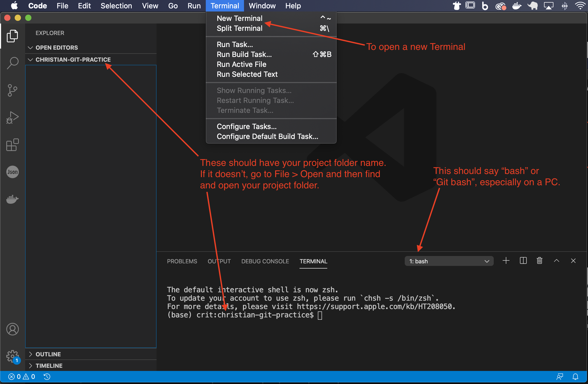
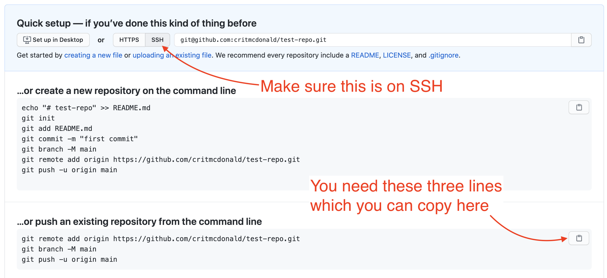
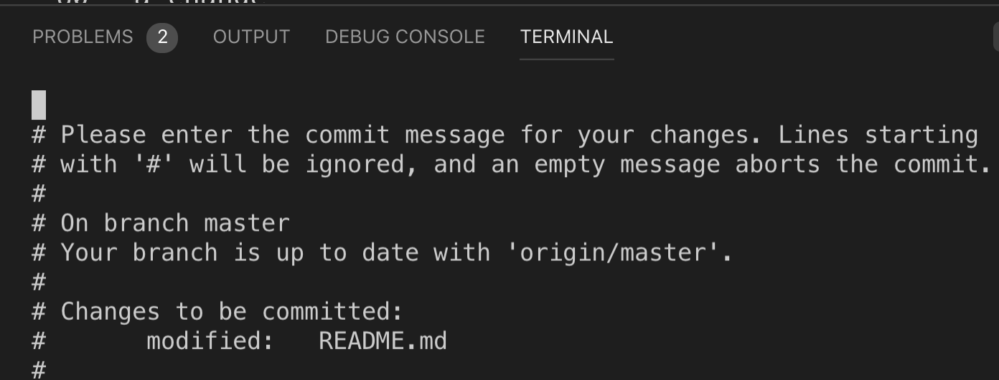

# Git version control

Make sure you've [installed VS Code, Git, have configured it and have a Github account with SSH keys](https://github.com/utdata/icj-setting-up) before continuing here.

## Defining version control

[Search on google](https://www.google.com/search?q=understanding+git+version+control&oq=understanding+git+version+control) and you'll find a ton of [posts](https://www.atlassian.com/git/tutorials/what-is-version-control), [tutorials](https://www.codecademy.com/learn/learn-git) and [videos](https://www.youtube.com/watch?v=Y9XZQO1n_7c) about Git and version control systems. I encourage you to explore some that fit your learning style. We'll just cover enough here to get you going and we'll learn by doing.

At its most basic, Git allows you to save your work at intervals and it keeps a history of files on your computer when you choose to save them. Once you have something that works, you can "commit" it and leave a comment about what you've done. You can then go back to that exact point in time if you need to. This frees the developer to experiment and make changes that may NOT work, because you know you can always go back. It works for any kind of file you want to put under version control.

Git allows for a "distributed" version control system, meaning that all the code can be stored on a central server (like on the Internet) so other people can work on the shared code. When they "check out" a repository (or repo), they get the entire code base. Contributors can then make changes and "check in" those changes for others to use.

[Github](https://github.com) is the central server we will use to save our code. It's also a project management tool and a social network of sorts. It's probably the most popular programming service on the planet. [Bitbucket Cloud](https://bitbucket.org/) is another popular code sharing service.

## Our goals

A repository — or "repo" — is a folder on your computer that is tracked by git. Our goals here are the following:

- Create a local repo inside our `icj` project folder.
- Create a public repo on Github.
- Connect the local repo to public Github repo.
- Edit files and use the git cycle to save and push your changes to Github.

### Use Google Chrome

I recommend that you use Google Chrome as your browser for this class. It is what I'll use in class and demonstrations, and it has lots of development tools built in that will come in handy.

### Visual Studio Code

We'll start using our code editor, Visual Studio Code, with this assignment. I'll sometimes refer to this program as VS Code or just Code.

In our computer setup and command-line lessons, we used either the Terminal/Git Bash programs to talk to our computers. Now that we have VS Code installed, we'll almost always use our Terminal from inside VS Code. It's the same thing, just tucked inside VS Code.

## Project setup

This is something we'll do time and again. Don't just follow the steps blindly ... learn and understand what you are doing so you can do this without thinking much about it.

### Folders and files

- Use the Finder on your computer to locate your `Documents/icj` folder and inside of it create a new project folder called `yourname-git-practice`. Always use all lower-case letters and dashes instead of space. It's just good practice.
- Launch Visual Studio Code and start a **New window**. (You can find under the File menu, or use Command-option-N).
- On the Welcome screen, you will see a link called **Open folder**. (If you don't see this, click on the page icon at top-left, which is the Explorer menu.) Click on that Open Folder button and negotiate your way to your project folder, select it and click the **Open** button.



- Go to the Terminal menu and choose New Terminal. This will open a terminal window inside of VS Code, which is super handy. The top line of the terminal should give you the path to inside your project folder, like `~/Documents/icj/christian-git-practice`. If it doesn't then you didn't open the folder first.



### The README

Every coding project should have a special file called a [README file](https://www.makeareadme.com/) which outlines what the project is and how to use it. It is often written in [Markdown](https://guides.github.com/pdfs/markdown-cheatsheet-online.pdf), which is a text-based syntax that Github turns into pretty HTML when it is published, but is completely readable as text. It also has great support to show code, tables, lists and such. Here is a [cheatsheet of the syntax](https://commonmark.org/help/) and [10-minute tutorial](https://commonmark.org/help/tutorial/) you may find useful. For what it is worth, this document and all lessons for this class are written in Markdown.

I want you to _always_ have a README file with your projects, and it should _always_ be called `README.md`. Yes, with capital letters for `README` and lower-case letters for `.md`. It breaks filename conventions because it is special.

- Create the file first. I would recommend using the Terminal inside VS Code and doing `touch README.md`. (There are other ways, but get used to using `touch`).
- The file now appears in the file explorer in VS Code on the left. You can click on that to open it.
- Now add a title, your name, the assignment name and when it is due. Like this:

```md
# Christian's git practice

By Christian McDonald, Intro Coding for Journalists class

This repo is a class assignment to learn git. It is due Month Day, Year.
```


- Update the files with your info, save and close it.

I want something like that on every project you make in this class: **title, your name, the assignment and when it is due**. Your projects early in the class won't have an extensive README [like some others](https://github.com/statesman/advanced-courses), but I want you to be in the habit of using them.

### Using gitignore

Your computer and the programs that run on it create all kinds of hidden files that you don't normally see. When looking in folders with the VS Code explorer, you might on a Mac a file called `.DS_Store`, which is a hidden file the computer creates when you view a folder. On Windows, you might see `.Thumbs.db`, which is a record of images saved in a folder. We often don't want to save these files or others into our git history, so we create another hidden file called a [.gitignore](https://help.github.com/articles/ignoring-files/) file to tell git to ignore certain things. An easy way to create one is to use the website [gitignore.io](https://www.gitignore.io/).

Creating hidden files like the `.gitignore` through the Mac/Windows regular file structure can be tricky, so it is best to do it from a terminal.

- In your Integrated Terminal in VS Code type the command `touch .gitignore`. Yes, it starts with a period and there is NO file extension for this file, so no `.txt` or anything ... it should be just `.gitignore`. Once created, it should show up in your list of files in VS Code on the left-hand screen. Go ahead and open it in VS Code by double-clicking on in the explorer.
- Go to the website [gitignore.io](https://www.gitignore.io/) in a browser. Type in "VisualStudioCode" and choose it from the list. (Make sure is it "VisualStudioCode" and not just "VisualStudio"). Type in "macOS" and add it, then "Windows" and add it to the list. Do them both, even if you only work on a Mac, just to be nice for future collaborators. (If you were using other programs like MicrosoftOffice or languages like Python, you would add those as well.) Click the **Create** button.
- Copy all the code there and paste it into your `.gitignore` file and save it. You can then close the file.

You can open this [screencast of making a gitignore file](https://drive.google.com/file/d/1VWyziglWMOMfCuTsGrRMAyiTgr8MAj9L/view?usp=sharing) in a new browser window (control-click on the link and choose **Open in new tab**) and watch an example.

(Gifs are really big files, so for longer demos I use videos. By the way, in the video I switch between programs by holding down the command button and then using tab to cycle through the programs. Very useful! It's Alt-tab on a Windows.)

### Initializing your local repo

The next steps are to initialize your local git record, stage files and commit them. We do these commands in our integrated Terminal.

- Do `git init` to initialize the repo so git will start tracking changes.

### Stage changes

Next we will "stage" our files by adding them to the list of tracked files. You sometimes don't want to track all your files, so you can add each one using their file name. This time we do want to track all of them, so we'll use a shortcut:

```bash
git add .
```

This will add (or "stage") all the untracked files to git, but it hasn't saved them yet.

### Commit changes

Next we want to "commit" them (which means save them) and include a message to say why we made changes to these files. ALWAYS include the `-m` flag when you commit, with a message.

- Do this command in your Terminal. Note the quotes:

```bash
git commit -m "my first commit"
```


Congratulations ... you have now saved a snapshot in time of all these files.

### Creating your public Github repo

- Go to [github.com](https://github.com) (and log in if you are not) and find the + sign at the top right.
- Click on that and choose **New repository**.
  - Name the repo the same as your local one: `yourname-git-practice`. (I always name my Github repo the same name as the folder on my computer for clarity, but know they technically could be different.)
  - Give it a description so you know what it is later.
  - Keep it Public.
  - DO NOT include a README here, or a gitignore or license.
  - Click **Create repository**.

Once you create the repo, you'll get a page back with a lot of code.

- Make sure the `SSH` button is selected in the top box. (We are selecting this because during your computer setup we set up SSH keys between your computer and Github.)
- Go to the second block **"… or push an existing repository from the command line"** and copy the code there to get the three lines.



- Paste those into your VS Code Terminal and run it. You _might_ have to press return again to run the last line.

Here is what these three lines of code did:

1. Added a `git remote` connection between your local computer and the Github repo. Now your local files are are linked to those store don the Internet.
2. Changed the name of your branch to `main`. (More on this below.)
3. Pushed the changes from your local machine to Github so the Internet has the most recent version.

From now on, you'll use `git push origin main` to push your code.

- If you go back to your Github repo and refresh the page you'll see your new files listed there.

Here is a [screencast of the complete project setup](https://drive.google.com/file/d/1qdL7BS6wtk14Rise5YO9MTW9FLvyRw-k/view?usp=sharing) of creating a local project, README, gitignore, initializing git, creating a Github repo and connecting it to your local project.

### Change master to main

We're going to digress here a minute. When you created your repo the default "branch" was named _master_, a term that many people find offensive given the history of slavery in the world. Sometime in 2021, perhaps even during the course of this class, git will change the default branch name to _main_. Github, our internet cloud service we are using, has already made the switch, one of the commands Github suggested you do was `git branch -M main`, which change the branch name.

We only have to do this once, the first time we set up a repo.

> This change from master to main is new and fluid. As such, you will likely see references to _master_ in my videos, lessons and elsewhere. We might have to make workflow adjustments during the semester. If you see reference to the _master_ branch in any directions, you might try _main_ first.

### Adding a new file

We're going to use the Integrated Terminal again (I'm just going to say "terminal" from now on) to create yet another a new file, commit it, and then push it to Github.

- Go into the terminal and use the `touch` command to create a new file, **using your name** for the file name. It will be a Markdown file:

```bash
touch myname.md
```

- You'll notice the file show up in the list of files in the File Explorer on the left. Click on that and it will open the file in the editor.
- Add a headline and some text to the file, like this below:

``` markdown
# A new Markdown page

I'm learning git and Github and this repo will help me. Don't judge.
```

> If we didn't talk about Markdown in detail earlier, now is a good time to review the [Markdown syntax](https://guides.github.com/pdfs/markdown-cheatsheet-online.pdf).

You can save the file, but keep it open.

### The git cycle

There are typically three steps to committing code in git:

- `git add` to stage files that have changed.
- `git commit -m` to commit (or save) the files. We'll add the message at the same time.
- `git push origin <branch>` to publish the changes to Github. We will almost always be using the `main` branch.

There is a fourth command we also use with the three above, but you can do it at any time to check where you are in the git workflow:

- `git status` to check what files have changed, etc.

We use these commands A LOT.

Let's check the status of our repo.

- Go into the Terminal, and type in the `git status`. Here is my command and response:

``` bash
$ git status
On branch main
Your branch is up-to-date with 'origin/main'.
Untracked files:
  (use "git add <file>..." to include in what will be committed)

        christian.md

nothing added to commit but untracked files present (use "git add" to track)
✔ ~/Documents/icj/christian-git-practice [main|…1]
```

We have one untracked file, `christian.md`, and Git has been nice enough to tell you how to stage your file. Let's add it with `git add christian.md` (but use your filename). Here is the command and response:

``` bash
$ git add christian.md
✔ ~/Documents/icj/christian-git-practice [main|●1]
```

There wasn't really a response back because it "worked", but because I have the git-bash-prompt extension installed (which you should have installed in [setting-up](https://github.com/utdata/icj-setting-up)), I have some feedback. We haven't talked about that yet, but that part `[main L|●1]` tells me we are on the `main` branch (more on that later) and that I have one staged file. Just watch how those signals change as we go through the cycle.

Now let's commit the file. We will also add a "message" to the commit using the flag `-m`, which you should ALWAYS do. It's good coding practice. Here is the call and response:

``` bash
$ git commit -m "adding my new file"
[main 8809887] adding my new file
 1 file changed, 3 insertions(+)
 create mode 100644 christian.md
✔ ~/Documents/icj/christian-git-practice [main ↑·1|✔]
```

Congrats! You have made your second commit, saving this point in time on your computer. Our next step is to push that new change to Github.

- Use the `git push origin main` command to push this to Github. Part of the `push` command is to say exactly where to send these change. This is the command and the response:

```bash
$ git push origin main
Enumerating objects: 3, done.
Counting objects: 100% (3/3), done.
Delta compression using up to 8 threads.
Compressing objects: 100% (2/2), done.
Writing objects: 100% (2/2), 274 bytes | 274.00 KiB/s, done.
Total 2 (delta 0), reused 0 (delta 0)
To github.com:critmcdonald/christian-git-practice.git
   50688af..2f80abc  main -> main
✔ ~/Documents/icj/christian-git-practice [main L|✔]
```

That's a lot of mumbo jumbo that we don't have to understand details of, we just have to recognize that it did "Writing" and you didn't get an error.

Why `origin main`? This is the part that sends this to our Github repo to share with the world. The `main` part is the branch name, and that is something we may get into later in the semester.

- Now go back to your Github repo in your browser and hit refresh on your repo, and you'll see the result there. Woo hoo!

## Repeat: Add, commit, push

Now let's make another change to your file and repeat the cycle.

- Go into VS Code and add a new sentence to your `myname.md` file.
- Use the terminal to check the status of your repo using `git status`.

```bash
$ git status
On branch main
Your branch is up to date with 'origin/main'.

Changes not staged for commit:
  (use "git add <file>..." to update what will be committed)
  (use "git checkout -- <file>..." to discard changes in working directory)

        modified:   christian.md

no changes added to commit (use "git add" and/or "git commit -a")
✔ ~/Documents/icj/christian-git-practice [main|✚ 1]
```

- The return says we have one modified file. Since it is the only modified file and we want to stage it, we'll use a fancy command to add "all" the modified files so we don't have to name it. The period means "all changed files".

```bash
$ git add .
✔ ~/Documents/icj/christian-git-practice [main|●1]
```

There is no response for staging a file if it is successful.

- Now finish it out by committing the changes:

```bash
$ git commit -m "adding changes"
[main 22acae0] adding changes
 1 file changed, 2 insertions(+)
✔ ~/Documents/icj/christian-git-practice [main ↑·1|✔]
```

- And then push them to main with: `git push origin main`

```bash
$ git push origin main
Enumerating objects: 5, done.
Counting objects: 100% (5/5), done.
Delta compression using up to 8 threads.
Compressing objects: 100% (3/3), done.
Writing objects: 100% (3/3), 329 bytes | 329.00 KiB/s, done.
Total 3 (delta 1), reused 0 (delta 0)
remote: Resolving deltas: 100% (1/1), completed with 1 local object.
To github.com:critmcdonald/christian-git-practice.git
   8809887..b36328f  main -> main
✔ ~/Documents/icj/christian-git-practice [main|✔]
```

Well done! You've learned the basic git cycle and pushed code to Github.

## Turn in your assignment

In Canvas, find "Version control assignment" and submit the URL of your Github repo.

---

## If you forget -m

If you are committing files with `git commit` and you forget to add the `-m` flag or the message in quotes after it, you will get thrown into an odd program called VIM. It will look something like this:



If this happens:

- Press `i` on your keyboard to get into _insert_ mode.
- Type your commit message into that first line.
- Hit the `esc` key at the top left of your keyboard to get out of _insert_ mode.
- Type `:wq` on your keyboard. Your cursor will move to the bottom of the window. That is OK.
- Hit return to end the command.

You'll get thrown back into your regular Terminal and be able to continue.

I don't want to get into what the VIM commands are, but basically `:wq` means "write" and "quit".

This GIF shows the process, but not the keystrokes, so use the directions above. Best yet, DON'T FORGET `-m`!


---

Notes to self:

- first-commit.gif uses master
- vim-commit.png uses master
